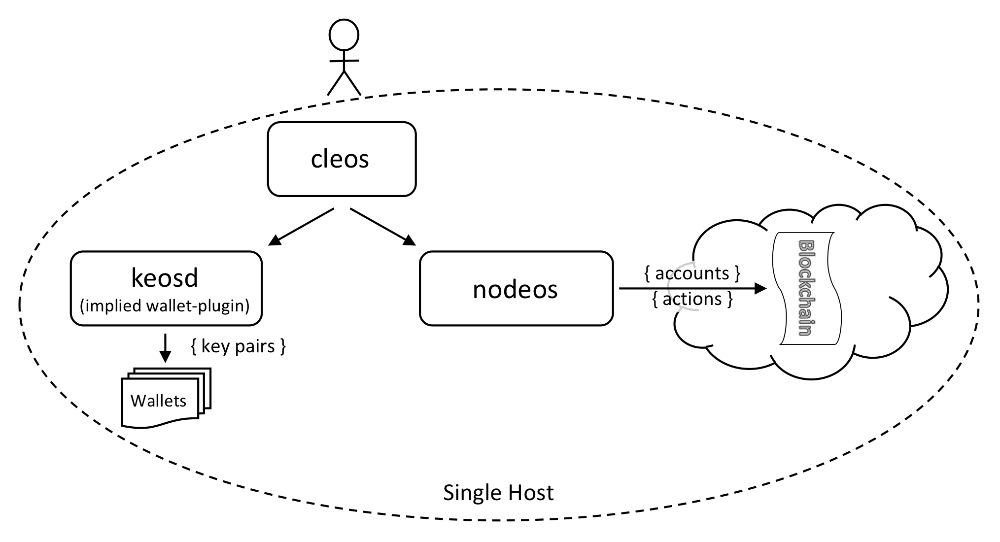

## Goal

This section describes how to set up a single-node blockchain configuration running on a single host with [consensus protocol](https://developers.upcx.io/welcome/v2.1/protocol/consensus_protocol) enabled. This is referred to as a _**single host, single-node testnet with consensus**_. We will set up one node on your local computer and have it produce blocks. The following diagram depicts the desired single host testnet.



`cleos` is used to interact with wallets, and send actions to the blockchain. `keosd` performs wallet management, including digital signing. If not started explicitly, `keosd` is started by `cleos` by default.

## Before you begin

- [Install the UPCXIO software](../../../00_install/index.md) before starting this section.
- It is assumed that `nodeos`, `cleos`, and `keosd` are accessible through the path
- Know how to pass [Nodeos options](../../02_usage/00_nodeos-options.md) to enable or disable functionality.

## Steps

Open one "terminal" window and perform the following steps:

1. [Add the development key to the wallet](#1-add-the-development-key-to-the-wallet)
2. [Start the Producer Node](#2-start-the-producer-node)
3. [Preactivate Protocol Features](#3-preactivate-protocol-features)
4. [Get the System Smart Contracts](#4-get-the-system-smart-contracts)
5. [Install upcxio.boot System Contract](#5-install-upcxioboot-system-contract)
6. [Activate the Remaining Protocol Features](#6-activate-the-remaining-protocol-features)
7. [Install upcxio.bios System Contract](#7-install-upcxiobios-system-contract)

### 1. Add the development key to the wallet

Execute the following at the command prompt:

```sh
cleos wallet import --private-key 5KQwrPbwdL6PhXujxW37FSSQZ1JiwsST4cqQzDeyXtP79zkvFD3
```

### 2. Start the Producer Node

Start your own single-node blockchain with this single command:

```sh
nodeos -e -p upcxio --plugin upcxio::producer_plugin --plugin upcxio::producer_api_plugin --plugin upcxio::chain_api_plugin --access-control-allow-origin='*' --contracts-console --http-validate-host=false --verbose-http-errors
```

[[warning | Security Notice]]
| Do not use the parameters `--access-control-allow-origin='*'`, `--http-validate-host=false`, `--verbose-http-errors` and `--contracts-console`, in production because they either weaken the security or affect performance of your node.

After running `nodeos`, you should get log messages similar to the ones below. It means the blocks are successfully produced.

```sh
info  2021-01-07T15:59:07.902 thread-0  producer_plugin.cpp:2053      produce_block        ] Produced block 98fa5cdd7ce06ae8... #162 @ 2021-01-07T15:59:08.000 signed by upcxio [trxs: 0, lib: 161, confirmed: 0]
info  2021-01-07T15:59:08.401 thread-0  producer_plugin.cpp:2053      produce_block        ] Produced block 972190051a840992... #163 @ 2021-01-07T15:59:08.500 signed by upcxio [trxs: 0, lib: 162, confirmed: 0]
info  2021-01-07T15:59:08.901 thread-0  producer_plugin.cpp:2053      produce_block        ] Produced block d8727439a26f36f6... #164 @ 2021-01-07T15:59:09.000 signed by upcxio [trxs: 0, lib: 163, confirmed: 0]
info  2021-01-07T15:59:09.401 thread-0  producer_plugin.cpp:2053      produce_block        ] Produced block 6f2302aeb944c5ca... #165 @ 2021-01-07T15:59:09.500 signed by upcxio [trxs: 0, lib: 164, confirmed: 0]
...
info  2021-01-07T15:59:10.902 thread-0  producer_plugin.cpp:2053      produce_block        ] Produced block 8cd2384a28818e19... #168 @ 2021-01-07T15:59:11.000 signed by upcxio [trxs: 0, lib: 167, confirmed: 0]
...
info  2021-01-07T15:59:11.900 thread-0  producer_plugin.cpp:2053      produce_block        ] Produced block c8c82b50249e9f6d... #170 @ 2021-01-07T15:59:12.000 signed by upcxio [trxs: 0, lib: 169, confirmed: 0]
...
```

At this point, `nodeos` is running with a single producer, `upcxio`.

### 3. Preactivate Protocol Features

All of the protocol upgrade features introduced in v1.8 and on subsequent versions require a special protocol feature, also known as `PREACTIVATE_FEATURE`, to be activated.

To activate the special protocol `PREACTIVATE_FEATURE` run the following command from a terminal:

```sh
curl --request POST \
    --url http://127.0.0.1:8888/v1/producer/schedule_protocol_feature_activations \
    -d '{"protocol_features_to_activate": ["0ec7e080177b2c02b278d5088611686b49d739925a92d9bfcacd7fc6b74053bd"]}'
```

### 4. Get the System Smart Contracts

All of the protocol upgrade features introduced in v1.8 and on subsequent versions also require an updated version of the system smart contract which can make use of those protocol features.

Two updated reference system smart contracts, `upcxio.boot` and `upcxio.bios`, are available in both source and binary form within the [`upcx`](https://github.com/UPCXIO/upcx.git) repository. You can build them from source or deploy the binaries directly.

#### 4.1 Use the Prebuilt System Smart Contracts

To use the prebuilt system smart contract execute the following commands from a terminal:

```sh
cd ~
git clone https://github.com/UPCXIO/upcx.git
cd ./upcx/contracts/contracts/
pwd
```

Note the path printed at the command prompt, we will refer to it later as `EOSIO_SYSTEM_CONTRACTS_DIRECTORY`.

Alternatively you can build the system smart contracts from source with the following commands:

```sh
cd ~
git clone https://github.com/UPCXIO/upcx.git
cd ./upcx/contracts/contracts/
mkdir build
cd build
cmake ..
make
pwd
```

### 5. Install upcxio.boot System Contract

To install the `upcxio.boot` system contract execute the following command from a terminal. Make sure you replace the `EOSIO_SYSTEM_CONTRACTS_DIRECTORY` with the directory path where the `upcxio.boot.wasm` and `upcxio.boot.abi` files are located.

```sh
cleos set contract upcxio EOSIO_SYSTEM_CONTRACTS_DIRECTORY/upcxio.boot/bin/ upcxio.boot.wasm upcxio.boot.abi
```

You should see something similar to the following output:

```sh
Reading WAST/WASM from /users/documents/upcx/contracts/contracts/upcxio.boot/build/upcxio.boot.wasm...
Using already assembled WASM...
Publishing contract...
executed transaction: 2150ed87e4564cd3fe98ccdea841dc9ff67351f9315b6384084e8572a35887cc  39968 bytes  4395 us
#         upcxio <= upcxio::setcode               {"account":"upcxio","vmtype":0,"vmversion":0,"code":"0061736d0100000001be023060027f7e0060067f7e7e7f7f...
#         upcxio <= upcxio::setabi                {"account":"upcxio","abi":{"types":[],"structs":[{"name":"buyrambytes","base":"","fields":[{"name":"p...
```

### 6. Activate the Remaining Protocol Features

After you deploy the `upcxio.boot` contract, run the following commands from a terminal to enable the rest of the features which are highly recommended to enable an UPCXIO-based blockchain.

[[info | Optional Step]]
|These features are optional. You can choose to enable or continue without these features; however they are highly recommended for an UPCXIO-based blockchain.

```sh
echo KV_DATABASE
cleos push action upcxio activate '["825ee6288fb1373eab1b5187ec2f04f6eacb39cb3a97f356a07c91622dd61d16"]' -p upcxio

echo ACTION_RETURN_VALUE
cleos push action upcxio activate '["c3a6138c5061cf291310887c0b5c71fcaffeab90d5deb50d3b9e687cead45071"]' -p upcxio

echo CONFIGURABLE_WASM_LIMITS
cleos push action upcxio activate '["bf61537fd21c61a60e542a5d66c3f6a78da0589336868307f94a82bccea84e88"]' -p upcxio

echo BLOCKCHAIN_PARAMETERS
cleos push action upcxio activate '["5443fcf88330c586bc0e5f3dee10e7f63c76c00249c87fe4fbf7f38c082006b4"]' -p upcxio

echo GET_SENDER
cleos push action upcxio activate '["f0af56d2c5a48d60a4a5b5c903edfb7db3a736a94ed589d0b797df33ff9d3e1d"]' -p upcxio

echo FORWARD_SETCODE
cleos push action upcxio activate '["2652f5f96006294109b3dd0bbde63693f55324af452b799ee137a81a905eed25"]' -p upcxio

echo ONLY_BILL_FIRST_AUTHORIZER
cleos push action upcxio activate '["8ba52fe7a3956c5cd3a656a3174b931d3bb2abb45578befc59f283ecd816a405"]' -p upcxio

echo RESTRICT_ACTION_TO_SELF
cleos push action upcxio activate '["ad9e3d8f650687709fd68f4b90b41f7d825a365b02c23a636cef88ac2ac00c43"]' -p upcxio

echo DISALLOW_EMPTY_PRODUCER_SCHEDULE
cleos push action upcxio activate '["68dcaa34c0517d19666e6b33add67351d8c5f69e999ca1e37931bc410a297428"]' -p upcxio

 echo FIX_LINKAUTH_RESTRICTION
cleos push action upcxio activate '["e0fb64b1085cc5538970158d05a009c24e276fb94e1a0bf6a528b48fbc4ff526"]' -p upcxio

 echo REPLACE_DEFERRED
cleos push action upcxio activate '["ef43112c6543b88db2283a2e077278c315ae2c84719a8b25f25cc88565fbea99"]' -p upcxio

echo NO_DUPLICATE_DEFERRED_ID
cleos push action upcxio activate '["4a90c00d55454dc5b059055ca213579c6ea856967712a56017487886a4d4cc0f"]' -p upcxio

echo ONLY_LINK_TO_EXISTING_PERMISSION
cleos push action upcxio activate '["1a99a59d87e06e09ec5b028a9cbb7749b4a5ad8819004365d02dc4379a8b7241"]' -p upcxio

echo RAM_RESTRICTIONS
cleos push action upcxio activate '["4e7bf348da00a945489b2a681749eb56f5de00b900014e137ddae39f48f69d67"]' -p upcxio

echo WEBAUTHN_KEY
cleos push action upcxio activate '["4fca8bd82bbd181e714e283f83e1b45d95ca5af40fb89ad3977b653c448f78c2"]' -p upcxio

echo WTMSIG_BLOCK_SIGNATURES
cleos push action upcxio activate '["299dcb6af692324b899b39f16d5a530a33062804e41f09dc97e9f156b4476707"]' -p upcxio
```

### 7. Install upcxio.bios System Contract

To deploy the `upcxio.bios` system contract execute the following command from a terminal. Make sure you replace the `EOSIO_SYSTEM_CONTRACTS_DIRECTORY` with the directory path where the `upcxio.bios.wasm` and `upcxio.bios.abi` files are located.

```sh
cleos set contract upcxio EOSIO_SYSTEM_CONTRACTS_DIRECTORY/upcxio.bios/bin/ upcxio.bios.wasm upcxio.bios.abi
```

If you want instead of `upcxio.bios`, a more elaborate system smart contract like `upcxio.system`, you have to build it first and then execute the following command from a terminal (or from the shell). Make sure you replace the `EOSIO_SYSTEM_CONTRACTS_DIRECTORY` with the directory path where you have built the `upcxio.system` system contract, the directory path where `eoios.system.abi` and `upcxio.system.wasm` are located.

```sh
cleos set contract upcxio EOSIO_SYSTEM_CONTRACTS_DIRECTORY/upcxio.system/ upcxio.system.wasm upcxio.system.abi
```

[[info | What's next?]]
| We will explore how to setup and run a [single-host, multi-node testnet](20_local-multi-node-testnet.md).
